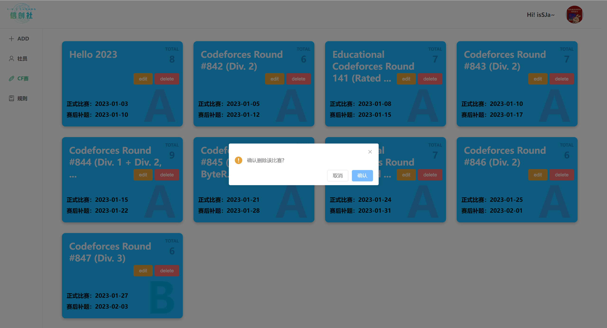
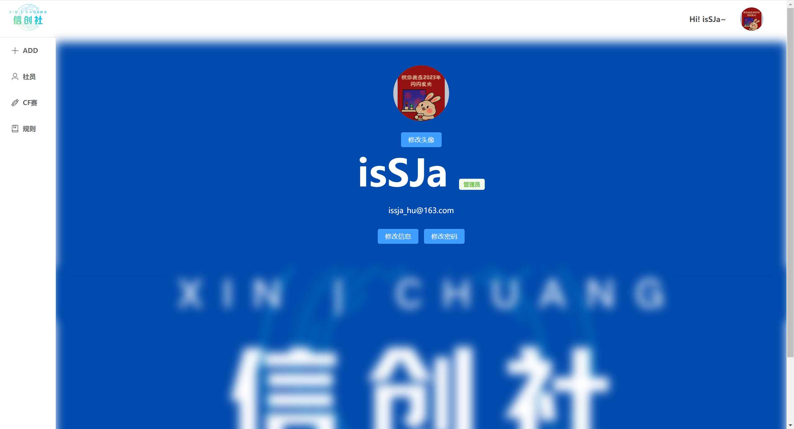

# XCS-CF Competition System

> Made by isSJa

## backgroud

## purpose

This project is to help the admin to manage the students who belongs to XCS and their points of contests in CF,as well to make it convenient for members of XCS to check the details of their points.

## technology stack

- BE：
  - springBoot
  - Mybatis-Plus
  - mysql
  - jwt
- FE：
  - html、css、js
  - vue3
  - vue-router
  - sass
  - typescript
  - axios
  - element-plus

## function

* register

* login

* for user
  
  * the information of members of XCS
    * check the details of points of them
    * search message through id , name , student number or CF account 
    * view the overall situation of CF contests in the form of point chart
  * the information of contests in CF
    * view the specific information of each contest, which includes 2 kinds of points, "duringContest points" and "afterContest points", and the members who have obtained these points
  * view point rules
  * personal center
    * display personal information
    * change avatar, username, email or password

* for admin
  
  * add some data
    * add a contest in CF
    * add a menmber of XCS
    * add the points a member gained in a CF contest
  * operate the members of XCS
    * check the details of points of them
    * search message through id , name , student number or CF account
    * view the overall situation of CF contests in the form of point chart
    * modify the information of them
    * delete a member
  * operate the contests in CF
    * view the specific information of each contest, which includes 2 kinds of points, "duringContest points" and "afterContest points", and the members who have obtained these points
    * modify the information of them
    * delete a contest
  * view point rules
  * personal center
    * display personal information
    * change avatar, username, email or password

* logout 

## preview

#### the interface of user

#### the interface of admin

